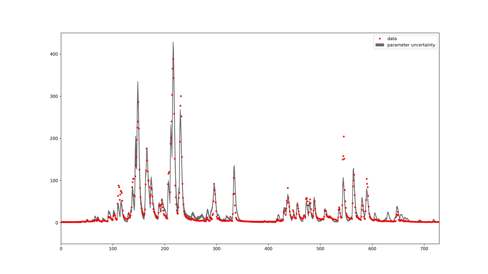
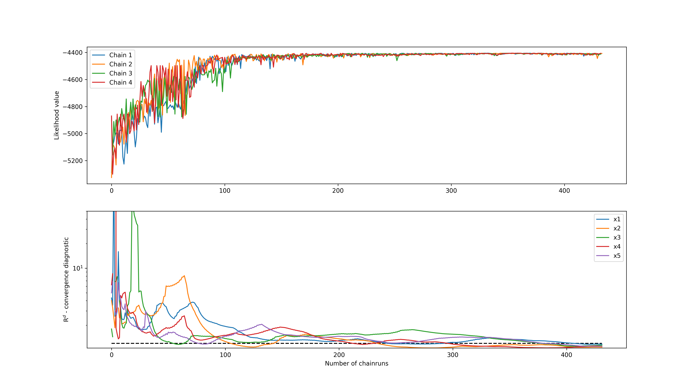
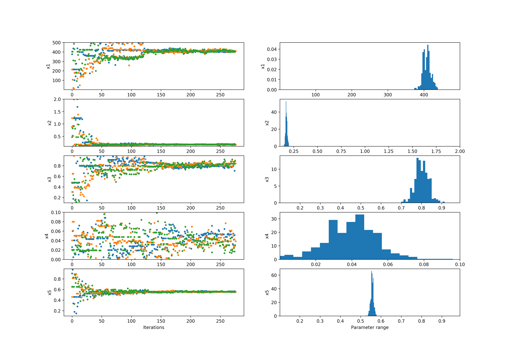

# Calibration of HYMOD with DREAM

This chapter shows you, how to link the external hydrological model  HYMOD with SPOTPY (works only on Windows systems).

We use the hydrological model HYMOD as an example, to calibrate it with the Differential Evolution Adaptive Metropolis (DREAM) algorithm. 
For detailed information about the underlying theorie, have a look at the [Vrugt (2016)](https://doi.org/10.1016/j.envsoft.2015.08.013 "Vrugt (2016)").
The SPOTPY package comes with an example which is desgined to help you to set up your own research project. 

First, we need to setup the model within a spot setup class. The model needs some meteorological input data and five parameters to estimate discharge:
  
## Connect HYMOD with SPOTPY

Here we use to \__init\__ function, to initialize the parameter for our model.

	class spot_setup(object):
		def __init__(self):

			self.params = [spotpy.parameter.Uniform('x1',low=1.0 , high=500,  optguess=412.33),
						   spotpy.parameter.Uniform('x2',low=0.1 , high=2.0,  optguess=0.1725),
						   spotpy.parameter.Uniform('x3',low=0.1 , high=0.99, optguess=0.8127),
						   spotpy.parameter.Uniform('x4',low=0.0 , high=0.10, optguess=0.0404),
						   spotpy.parameter.Uniform('x5',low=0.1 , high=0.99, optguess=0.5592)
						   ]
			self.curdir = os.getcwd()
			self.owd = os.path.realpath(__file__)+os.sep+'..'
			self.evals = list(np.genfromtxt(self.owd+os.sep+'hymod'+os.sep+'bound.txt',skip_header=65)[:,3])[:730]
			self.Factor = 1944 * (1000 * 1000 ) / (1000 * 60 * 60 * 24)
			print(len(self.evals))

		def parameters(self):
			return spotpy.parameter.generate(self.params)

We use the simulation function to write one random parameter set into a parameter file, like it is needed for the HYMOD model, 
start the model and read the model discharge output data:

		def simulation(self,x):
			os.chdir(self.owd+os.sep+'hymod')
			if sys.version_info.major == 2:
				params = file('Param.in', 'w')
			elif sys.version_info.major == 3:
				params = open('Param.in','w')
			else:
				raise Exception("Your python is too old for this example")
			for i in range(len(x)):
				if i == len(x):
					params.write(str(round(x[i],5)))
				else:
					params.write(str(round(x[i],5))+' ')
			params.close()
			os.system('HYMODsilent.exe')
			
			#try: 
			if sys.version_info.major == 2:
				SimRR = file('Q.out', 'r')
			elif sys.version_info.major == 3:
				SimRR = open('Q.out', 'r')
			else:
				raise Exception("Your python is too old for this example")
			simulations=[]
			for i in range(64):
				SimRR.readline()
			for i in range(730):
				val= SimRR.readline()
				simulations.append(float(val)*self.Factor)
			#except:#Assign bad values - model might have crashed
			#    SimRR = 795 * [np.nan]
			os.chdir(self.curdir)
			
			return simulations

And in a last step, we compare the observed and the simulated data. Here we choose one of the implemented Likelihood functions
in the SPOTPY package. Please mind that the selection of the Likelihood highly influences the results gained with this algorithm:

		def evaluation(self):
			return self.evals

		def objectivefunction(self,simulation,evaluation, params=None):
			like = spotpy.likelihoods.gaussianLikelihoodMeasErrorOut(evaluation,simulation)
			return like

## Sample with DREAM

Now we can initialize the Hymod example:

	spot_setup=spot_setup()

Create the Dream sampler of spotpy, alt_objfun is set to None to force SPOTPY
to jump into the def objectivefunction in the spot_setup class (default is
spotpy.objectivefunctions.log_p). Results are saved in a DREAM_hymod.csv file:

	sampler=spotpy.algorithms.dream(spot_setup, dbname='DREAM_hymod', dbformat='csv', alt_objfun=None)

Select number of maximum repetitions, the number of chains used by dream (default = 5) and set the Gelman-Rubin convergence limit (default 1.2).
We further allow 100 runs after convergence is achieved:

	nChains                = 4
	convergence_limit      = 1.2
	runs_after_convergence = 100

We start the sampler and collect the gained r_hat convergence values after the sampling:

	r_hat = sampler.sample(rep,nChains=nChains,convergence_limit=convergence_limit, 
                       runs_after_convergence=runs_after_convergence)

## Access the results
All other results can be accessed from the SPOTPY csv-database:

	results = spotpy.analyser.load_csv_results('DREAM_hymod')

These results are structured as a numpy array. Accordingly, you can access the different columns by using simple Python code,
e.g. to access all the simulations:

	fields=[word for word in results.dtype.names if word.startswith('sim')]
	print(results[fields)

## Plot model uncertainty
For the analysis we provide some examples how to plor the data.
If you want to see the remaining posterior model uncertainty:

	fig= plt.figure(figsize=(16,9))
	ax = plt.subplot(1,1,1)
	q5,q25,q75,q95=[],[],[],[]
	for field in fields:
		q5.append(np.percentile(results[field][-100:-1],2.5))
		q95.append(np.percentile(results[field][-100:-1],97.5))
	ax.plot(q5,color='dimgrey',linestyle='solid')
	ax.plot(q95,color='dimgrey',linestyle='solid')
	ax.fill_between(np.arange(0,730,1),list(q5),list(q95),facecolor='dimgrey',zorder=0,
					linewidth=0,label='parameter uncertainty')  
	ax.plot(spot_setup.evaluation(),'r.',label='data')
	ax.set_ylim(-50,450)
	ax.set_xlim(0,729)
	ax.legend()
	fig.savefig('python_hymod.png',dpi=300)

*Figure 1: Posterior model uncertainty of HYMOD.*

## Plot convergence diagnostic
If you want to check the convergence of the DREAM algorithm:

	fig= plt.figure(figsize=(16,9))
	plt.subplot(2,1,1)
	for i in range(int(max(results['chain']))+1):
		index=np.where(results['chain']==i)
		plt.plot(results['like1'][index], label='Chain '+str(i+1))

	plt.ylabel('Likelihood value')
	plt.legend()

	ax =plt.subplot(2,1,2)
	r_hat=np.array(r_hat)
	ax.plot([1.2]*len(r_hat),'k--')
	for i in range(len(r_hat[0])):
		ax.plot(r_hat[:,i],label='x'+str(i+1))

	ax.set_yscale("log", nonposy='clip')
	ax.set_ylim(-1,50)
	ax.set_ylabel('R$^d$ - convergence diagnostic')
	plt.xlabel('Number of chainruns')
	plt.legend()
	fig.savefig('python_hymod_convergence.png',dpi=300)

*Figure 2: Gelman-Rubin onvergence diagnostic of DREAM results.*

## Plot parameter uncertainty
Or if you want to check the posterior parameter distribution:

	def find_min_max(spot_setup):
		randompar=spot_setup.parameters()['random']        
		for i in range(1000):
			randompar=np.column_stack((randompar,spot_setup.parameters()['random']))
		return np.amin(randompar,axis=1),np.amax(randompar,axis=1)

	min_vs,max_vs = find_min_max(spot_setup)

	fig= plt.figure(figsize=(16,16))
	plt.subplot(5,2,1)
	x = results['par'+spot_setup.parameters()['name'][0]]
	for i in range(int(max(results['chain']))):
		index=np.where(results['chain']==i)
		plt.plot(x[index],'.')
	plt.ylabel('x1')
	plt.ylim(min_vs[0],max_vs[0])

	plt.subplot(5,2,2)
	x = results['par'+spot_setup.parameters()['name'][0]][int(len(results)*0.5):]
	normed_value = 1
	hist, bins = np.histogram(x, bins=20, density=True)
	widths = np.diff(bins)
	hist *= normed_value
	plt.bar(bins[:-1], hist, widths)
	plt.ylabel('x1')
	plt.xlim(min_vs[0],max_vs[0])

	plt.subplot(5,2,3)
	x = results['par'+spot_setup.parameters()['name'][1]]
	for i in range(int(max(results['chain']))):
		index=np.where(results['chain']==i)
		plt.plot(x[index],'.')
	plt.ylabel('x2')
	plt.ylim(min_vs[1],max_vs[1])

	plt.subplot(5,2,4)
	x = results['par'+spot_setup.parameters()['name'][1]][int(len(results)*0.5):]
	normed_value = 1
	hist, bins = np.histogram(x, bins=20, density=True)
	widths = np.diff(bins)
	hist *= normed_value
	plt.bar(bins[:-1], hist, widths)
	plt.ylabel('x2')
	plt.xlim(min_vs[1],max_vs[1])

	plt.subplot(5,2,5)
	x = results['par'+spot_setup.parameters()['name'][2]]
	for i in range(int(max(results['chain']))):
		index=np.where(results['chain']==i)
		plt.plot(x[index],'.')
	plt.ylabel('x3')
	plt.ylim(min_vs[2],max_vs[2])

	plt.subplot(5,2,6)
	x = results['par'+spot_setup.parameters()['name'][2]][int(len(results)*0.5):]
	normed_value = 1
	hist, bins = np.histogram(x, bins=20, density=True)
	widths = np.diff(bins)
	hist *= normed_value
	plt.bar(bins[:-1], hist, widths)
	plt.ylabel('x3')
	plt.xlim(min_vs[2],max_vs[2])

	plt.subplot(5,2,7)
	x = results['par'+spot_setup.parameters()['name'][3]]
	for i in range(int(max(results['chain']))):
		index=np.where(results['chain']==i)
		plt.plot(x[index],'.')
	plt.ylabel('x4')
	plt.ylim(min_vs[3],max_vs[3])

	plt.subplot(5,2,8)
	x = results['par'+spot_setup.parameters()['name'][3]][int(len(results)*0.5):]
	normed_value = 1
	hist, bins = np.histogram(x, bins=20, density=True)
	widths = np.diff(bins)
	hist *= normed_value
	plt.bar(bins[:-1], hist, widths)
	plt.ylabel('x4')
	plt.xlim(min_vs[3],max_vs[3])

	plt.subplot(5,2,9)
	x = results['par'+spot_setup.parameters()['name'][4]]
	for i in range(int(max(results['chain']))):
		index=np.where(results['chain']==i)
		plt.plot(x[index],'.')
	plt.ylabel('x5')
	plt.ylim(min_vs[4],max_vs[4])
	plt.xlabel('Iterations')

	plt.subplot(5,2,10)
	x = results['par'+spot_setup.parameters()['name'][4]][int(len(results)*0.5):]
	normed_value = 1
	hist, bins = np.histogram(x, bins=20, density=True)
	widths = np.diff(bins)
	hist *= normed_value
	plt.bar(bins[:-1], hist, widths)
	plt.ylabel('x5')
	plt.xlabel('Parameter range')
	plt.xlim(min_vs[4],max_vs[4])
	fig.savefig('python_parameters.png',dpi=300)

*Figure 3: Posterior parameter distribution of HYMOD.*
